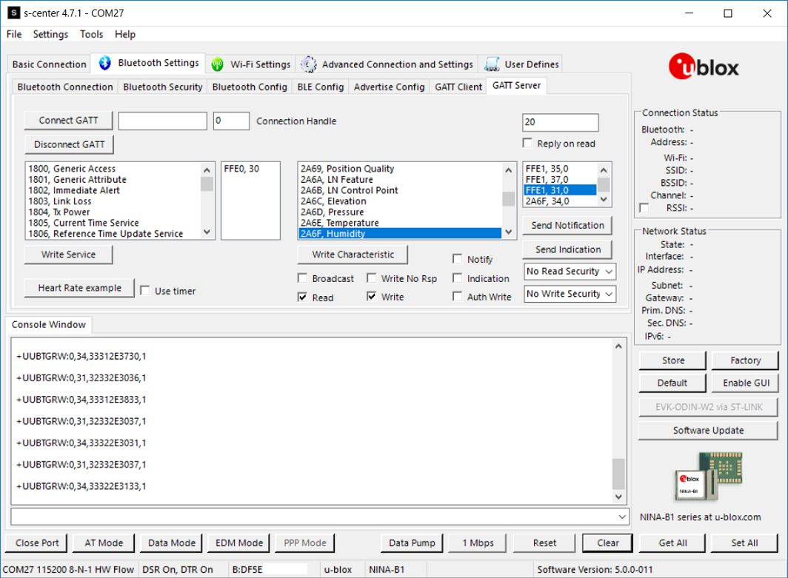

# Arduino-u-blox-NINA-W10

u-blox NINA-W10 Arduino example + SHT31 temperature and humidity + Bluetooth BLE

[](https://github.com/ldab/Arduino-u-blox-NINA-W10/releases/latest)
[](https://travis-ci.org/ldab/Arduino-u-blox-NINA-W10)
[](https://github.com/ldab/Arduino-u-blox-NINA-W10/blob/master/LICENSE)

[](https://github.com/ldab/Arduino-u-blox-NINA-W10)

[](https://www.u-blox.com/en/product/nina-W10-series)

## How to build PlatformIO based project

1. [Install PlatformIO Core](http://docs.platformio.org/page/core.html)
2. Download [development the repository with examples](https://github.com/ldab/Arduino-u-blox-NINA-w10)
3. Extract ZIP archive
4. Run these commands:

```
# Change directory to example
> cd Arduino-u-blox-NINA-W10

# Build project
> platformio run

# Upload firmware
> platformio run --target upload

# Build specific environment
> platformio run -e nina_W10

# Upload firmware for the specific environment
> platformio run -e nina_W10 --target upload

# Clean build files
> platformio run --target clean
```

## Why?

This example tries to implement some key functions and key PIN atributes in order to get you started with using Arduino and the Multiradio board u-blox NINA-W10.

## BLE Server, Client, Central, Peripheral ????? 😕

BLE roles are a bit confusing, at least to me, [Neil Kolban](https://github.com/nkolban) the same person behind the `ESP32 BLE Lib` has made some material available on his [YouTube Channel](https://www.youtube.com/watch?v=UgI7WRr5cgE)

Basicaly:
* Peripheral  -> Advertises
* Central     -> Scans for Peripherals
* GATT Server -> Device which has the database and provide resources to the Client. PS. Server does not send data, unless Client requests.
* GATT Client -> Access remote Server resources.

Generally, Peripheral = Server. Therefore if you're working on a end device, an activity tracker for example, it's likely to be set as a Peripheral.

## Examples

* Two examples are provided:
  * [Client](./Client/), connecting to a Peripheral GATT Server;
  * [Server](./Server/), connecting to a Central GATT Client;

## Using with s-center

* In order to test this example, NINA-W10 (Central/Client) connects to NINA-B1 (Peripheral/Server) via s-center and write the SHT31 temperature to the `FFE1` characteristics and humidity to `2A6F`.



## Partition Table and Flash size

* You can create a custom partitions table (CSV) following [ESP32 Partition Tables](https://docs.espressif.com/projects/esp-idf/en/latest/api-guides/partition-tables.html) documentation.

* Partitions examples are available at [GitHub arduino-esp32](https://github.com/espressif/arduino-esp32/tree/master/tools/partitions)

* `minimal.csv` is the default defined on [nina_w10.json](https://github.com/platformio/platform-espressif32/blob/master/boards/nina_w10.json) however I changed it in order to free some space up used by spiffs found on `partitions_custom.csv` [here](./partitions_custom.csv)
  * No OTA;
  * No SPIFFS;
  * No EEPROM;

## Erase Flash

`pio run -t erase` - > all data will be replaced with 0xFF bytes.

## Bluetooth iOS and Android app 

You can download the sample Bluetooth low energy app - BLE App straight from u-blox wesite: [https://www.u-blox.com/en/product/bluetooth-ios-and-android-app](https://www.u-blox.com/en/product/bluetooth-ios-and-android-app)


## Credits

Github Shields and Badges created with [Shields.io](https://github.com/badges/shields/)

Adafruit [SHT31 Library](https://www.adafruit.com/product/2857)

ESP32 BLE Arduino [Library](https://github.com/nkolban/ESP32_BLE_Arduino?utm_source=platformio&utm_medium=piohome)
